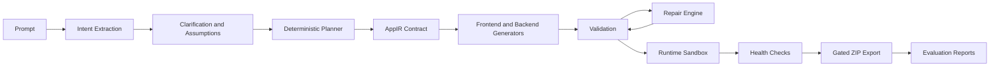

# AI App Compiler

AI App Compiler is a compiler-style application generation platform. A prompt moves through intent extraction, deterministic planning, IR generation, project generation, validation, repair, runtime launch, health checks, and gated ZIP export.

## Architecture



## Core Guarantees

- Deterministic AppIR planning through `backend/contracts/app_ir_schema.py`.
- Provider orchestration in Gemini, Groq, OpenAI, local deterministic order.
- Offline demo mode with `OFFLINE_DEMO_MODE=true`.
- Validation before export for syntax, execution readiness, route registration, security, and frontend/backend API configuration.
- Runtime sandbox validation for backend startup, frontend startup, auth endpoints, route registration, frontend reachability, and API client configuration.
- ZIP export only when validation, repair, runtime validation, and health checks pass.

## Local Setup

Backend:

```bash
cd backend
python -m venv venv
venv\Scripts\activate
pip install -r requirements.txt
uvicorn main:app --port 8000
```

Frontend:

```bash
cd frontend
npm install
npm run dev
```

Open `http://localhost:3001` for the compiler UI and `http://localhost:8000/docs` for the API.

## Demo Flow

1. Enter a prompt in the compiler UI.
2. Watch pipeline status after the backend responds.
3. Review provider used, fallback events, validation status, repair status, runtime status, and metrics.
4. Download the ZIP only when export gating approves it.

## Benchmark and Repair Proof

Run a fast deterministic benchmark:

```bash
cd backend
python benchmark_runner.py --limit 3
```

Run the full prompt and edge-case suite:

```bash
cd backend
python benchmark_runner.py
```

Run repair proof:

```bash
cd backend
python repair_demo.py
```

Run runtime repair proof:

```bash
cd backend
python repair_demo.py --runtime
```

Reports are written under `backend/generated_projects/`:

- `evaluation_report.json`
- `quality_score.json`
- `failure_report.json`
- `repair_report.json`

Generated projects include:

- `runtime_metrics.json`
- `health_report.json`
- `repair_report.json`
- `quality_score.json`
- `pipeline_report.json`

## Docker

Copy `.env.example` to `.env` and set provider keys if desired. Offline mode works without keys.

```bash
docker compose up --build
```

Services:

- Frontend: `http://localhost:3000`
- Backend: `http://localhost:8000`

## Submission Notes

Do not submit local secret files such as `backend/.env`. Use `.env.example` for configuration shape. The repository is ready to demonstrate deterministic orchestration, runtime awareness, self-healing repair, provider fallback, benchmark metrics, and deployment readiness.
