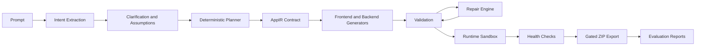

# AI App Compiler

## 1. Project Title
AI App Compiler

## 2. Project Overview
AI App Compiler is a compiler-style application generation platform. A prompt moves through intent extraction, deterministic planning, Intermediate Representation (IR) generation, project generation, validation, repair, runtime launch, health checks, and gated ZIP export. It ensures that the generated applications are robust, structurally sound, and immediately deployable.

## 3. Key Features
- **Deterministic AppIR Planning**: Predictable and structured project generation.
- **Provider Orchestration**: Fallback logic across Gemini, Groq, OpenAI, and local models.
- **Validation Before Export**: Checks syntax, execution readiness, route registration, security, and frontend/backend API configuration.
- **Self-Healing Repair Engine**: Automatically detects code errors and fixes them before runtime.
- **Fast Structural Runtime Validation**: Ensures generated applications are valid without slow boot times.
- **Gated ZIP Export**: Only allows code download when validation, repair, runtime validation, and health checks pass.
- **Offline Demo Mode**: Fully functional offline generation sequence.

## 4. Architecture Overview
The platform strictly separates the frontend (React/Vite) from the backend (FastAPI), while coordinating the complex AI generation sequence through structured pipelines. 

* **Frontend**: React and Vite application orchestrating the UI compiler flow.
* **Backend**: FastAPI Python backend executing the multi-agent generation logic.
* **Validators**: Performs AST-based analysis and structural checks on generated code.
* **Repair Engine**: Triggers isolated LLM calls specifically to correct syntax/validation errors.
* **Generators**: Template-driven and LLM-assisted code synthesis modules.
* **Runtime Validation**: Fast structural checks (no heavy `npm` or `uvicorn` boots) ensuring deployment readiness.
* **Export System**: Compresses the validated project into a ZIP format and delivers it to the client.

## 5. Tech Stack
- **Frontend**: React, Vite, Tailwind CSS
- **Backend**: Python, FastAPI, Uvicorn
- **AI Integration**: Custom provider orchestration (Gemini, Groq, OpenAI)
- **Deployment**: Vercel (Frontend), Render (Backend), Docker

## 6. AI Pipeline Flow


## 7. Runtime Validation System
The runtime validation system uses lightweight static and structural checks instead of full execution. It verifies:
- Directory structures (`frontend/`, `backend/`, `src/`).
- Package files (`package.json`, `requirements.txt`).
- Core entry points (`main.py`, `App.jsx/tsx`, `main.jsx/tsx`).
- FastAPI syntax validation and router registration using Python `ast`.
This ensures fast feedback and avoids heavy compute timeouts on free-tier infrastructure.

## 8. Repair Engine
When validation or runtime checks fail, the Repair Engine parses the specific error logs and traces them back to the generated files. It dispatches a targeted sub-prompt to the LLM containing only the erroneous file and the error trace, allowing it to "heal" the code before re-entering the validation loop.

## 9. Benchmark System
The platform includes an automated benchmark system to test generation determinism, repair rates, and overall quality against an evolving suite of complex prompts.

Run a fast deterministic benchmark:
```bash
cd backend
python benchmark_runner.py --limit 3
```

Run the full prompt and edge-case suite:
```bash
cd backend
python benchmark_runner.py
```

Run repair proof:
```bash
cd backend
python repair_demo.py
```

## 10. Deployment Architecture
* **Frontend (Vercel)**: The React app is continuously deployed on Vercel. 
* **Backend (Render)**: The FastAPI service is deployed on Render via Docker or native Python environment.
* **Environment Variables**: Managed via `.env` for API keys, backend URL (`VITE_API_URL` for frontend), and offline mode flags.

## 11. Screenshots Section

### Platform Interface


### Documentation & Health


### Deployments


### Internal Systems


## 12. Live Demo Links
- **GitHub Repository**: [surya066-git/ai-app-compiler](https://github.com/surya066-git/ai-app-compiler)
- **Vercel Frontend**: [Live App](https://ai-app-compiler-puce.vercel.app)
- **Render Backend**: [Swagger UI](https://ai-app-compiler-cvmu.onrender.com/docs)
- **Demo Video**: [*(git)*](https://drive.google.com/file/d/1L97mSn41l4zlRd28xbUe5e2xTvB21O0v/view?usp=sharing)

## 13. Installation Instructions
Clone the repository:
```bash
git clone https://github.com/surya066-git/ai-app-compiler.git
cd ai-app-compiler
```

## 14. Local Development Setup
**Backend:**
```bash
cd backend
python -m venv venv
# Windows: venv\Scripts\activate
# Mac/Linux: source venv/bin/activate
pip install -r requirements.txt
uvicorn main:app --port 8000
```

**Frontend:**
```bash
cd frontend
npm install
npm run dev
```

Open `http://localhost:3001` for the compiler UI and `http://localhost:8000/docs` for the API.

## 15. Deployment Setup
### Docker (Recommended for Self-Hosting)
Copy `.env.example` to `.env` and set provider keys if desired. Offline mode works without keys.
```bash
docker compose up --build
```
Services:
- Frontend: `http://localhost:3000`
- Backend: `http://localhost:8000`

### Vercel (Frontend)
1. Import the repository into Vercel.
2. Set the root directory to `frontend`.
3. Add the Environment Variable `VITE_API_URL` pointing to your Render backend URL.

### Render (Backend)
1. Create a New Web Service connected to your repository.
2. Set the root directory to `backend`.
3. Use the Python runtime with start command: `uvicorn main:app --host 0.0.0.0 --port $PORT`.

## 16. Future Improvements
- Expand local LLM support via Ollama.
- Add real-time WebSocket streaming for pipeline logs.
- Introduce collaborative multi-user editing for generated AppIR.
- Improve Docker sandbox isolation for heavier runtime tests.

## 17. License
This project is licensed under the MIT License.

## 18. Author Section
Built by the AI App Compiler Engineering Team.
